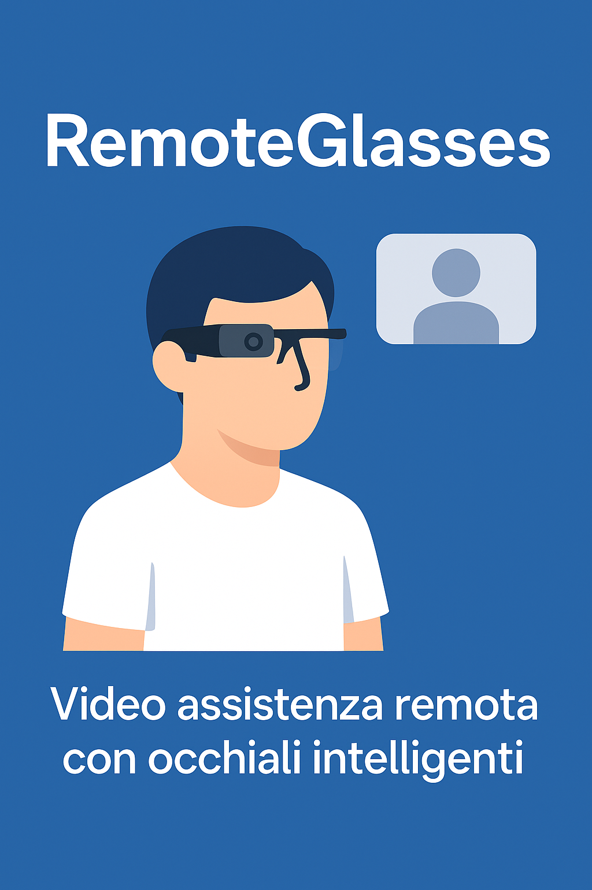

# RemoteGlasses



[](LICENSE)
[](#)
[](#)

**RemoteGlasses** è un progetto open-source (MIT) che permette di trasformare occhiali con telecamera (o smartphone fissato) in uno strumento di **video assistenza remota in tempo reale** grazie a **WebRTC**.

- 🎯 **Latenza bassa** (≈200–400 ms)  
- 🔒 **Privacy e controllo**: nessun cloud obbligatorio, server configurabile on-premise  
- 🧩 **Tutto in un’unica repo**, con due versioni pronte all’uso  

---

## 📂 Struttura della repository

RemoteGlasses/
├── remote-glasses/              → versione base (PWA + signaling Node separato)
├── remote-glasses-online-demo/  → versione demo online pronta per Render/Glitch
├── LICENSE                      → licenza MIT
├── promo-banner.png             → immagine promozionale
└── README.md                    → questo file

---

## 🔹 [remote-glasses/](./remote-glasses)

Versione **base**, pensata per:
- sviluppo locale
- installazione **on-premise** sul server del cliente
- integrazione con **coturn** per funzionare dietro NAT/firewall

👉 Contiene:
- `index.html`, `app.js`, `server.js`
- `manifest.json`, `sw.js` (installabile come PWA)
- `turnserver.conf.sample` (config esempio coturn)
- guida rapida nel `README.md`

---

## 🔹 [remote-glasses-online-demo/](./remote-glasses-online-demo)

Versione **demo tutto-in-uno**, già pronta per il **deploy online** (Render, Glitch, Railway).  
Serve sia i file statici della PWA sia il signaling WebSocket `/ws` dallo stesso dominio.

👉 Contiene:
- `server.js` (Express + ws)
- `package.json`, `Procfile` (per deploy su Render/Glitch)
- `index.html`, `app.js`, manifest e icone
- `README_DEPLOY.md` (guida passo-passo)

🌍 Dopo il deploy avrai un URL pubblico, es.:

https://remote-glasses.onrender.com

Aprilo, scegli Ruolo = *Occhiali*, imposta Room ID e condividi il link → il Viewer si collega da remoto.

---

## 🚀 Come provarlo subito (locale)

### Versione base
```bash
cd remote-glasses
npm init -y
npm i ws
node server.js      # signaling su ws://localhost:8080
python -m http.server 8000
# apri http://localhost:8000/index.html

Versione demo online

cd remote-glasses-online-demo
npm install
npm start
# apri http://localhost:3000


⸻

📈 Roadmap
	•	🔑 Token temporanei per room + scadenze
	•	🔁 Reconnect automatico & adattamento bitrate
	•	🖊️ Annotazioni/overlay lato viewer
	•	🎥 Registrazione lato viewer
	•	📱 App Android “container” (WebView) per occhiali RealWear/Vuzix

⸻

📄 Licenza

MIT • © RemoteGlasses Project
